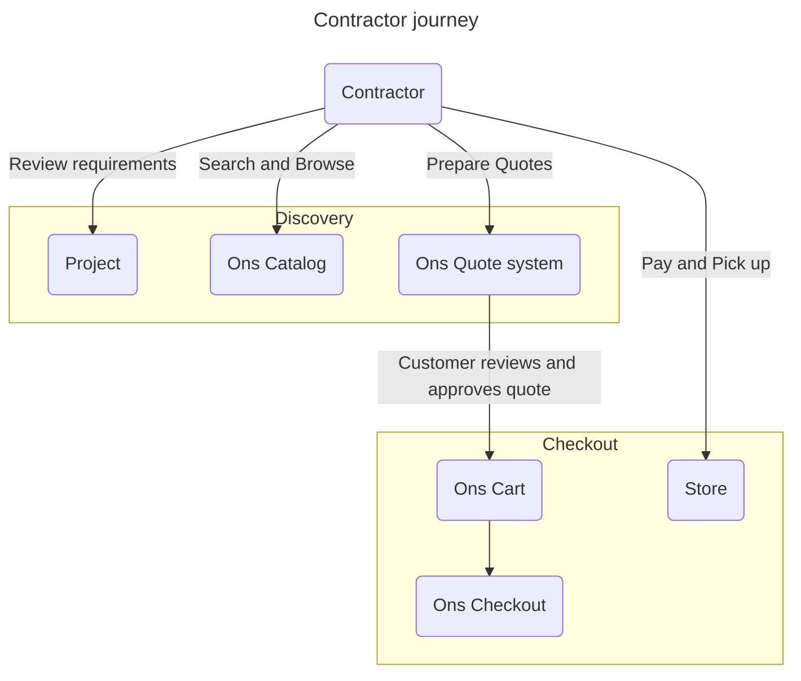
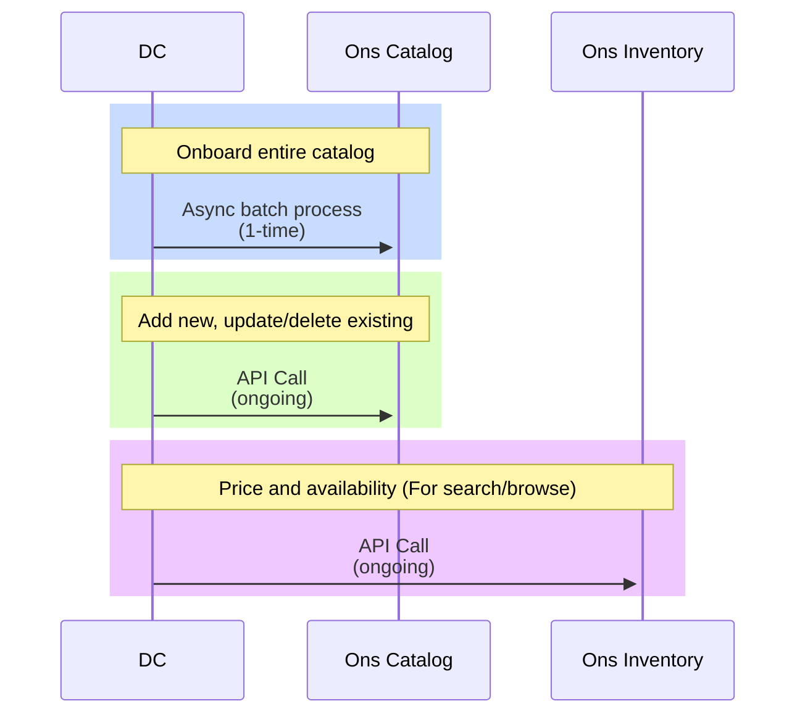
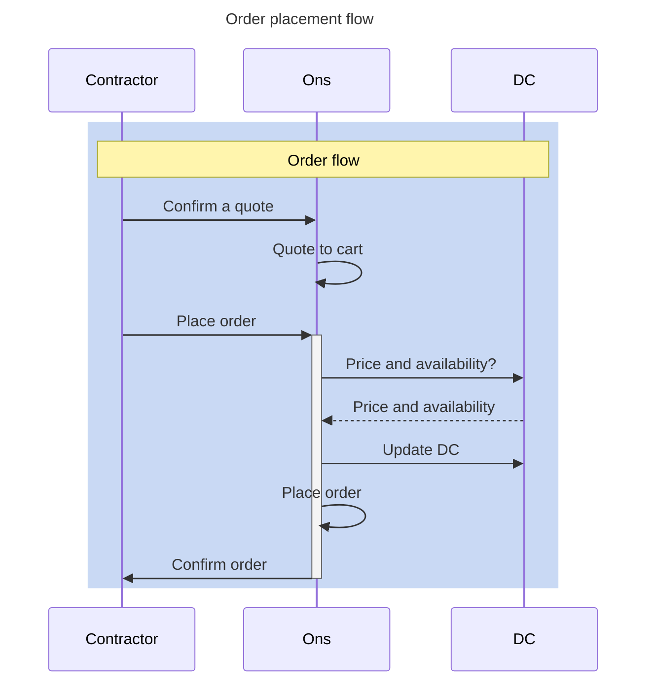

## Contractor journey

```mermaid
---
title: Contractor journey
---
      flowchart TB
        Contractor(Contractor)
        subgraph Discovery
          Project(Project)
          OnsCatalog(Ons Catalog)
          OnsQuoteSystem(Ons Quote system)
        end
        subgraph Checkout
          OnsCart(Ons Cart)
          CheckoutNode(Ons Checkout)
          Store(Store)
        end
        Contractor -->|Review requirements| Project
        Contractor -->|Search and Browse| OnsCatalog
        Contractor -->|Prepare Quotes| OnsQuoteSystem
        OnsQuoteSystem -->|Customer reviews and approves quote| OnsCart
        OnsCart --> CheckoutNode
        Contractor -->|Pay and Pick up| Store
```

## Catalog management

```mermaid 
    sequenceDiagram
      rect rgb(200, 220, 255)
        Note over DC,Ons Catalog: Onboard entire catalog
        DC->>+Ons Catalog: Async batch process<br/>(1-time)
      end
      rect rgb(220, 255, 200)
        Note over DC,Ons Catalog: Add new, update/delete existing
        DC->>+Ons Catalog: API Call<br/>(ongoing)
      end
      rect rgb(238, 200, 255)
        Note over DC,Ons Inventory: Price and availability (For search/browse)
        DC->>+Ons Inventory: API Call<br/>(ongoing)
      end
```
## Order placement flow

```mermaid 
---
title: Order placement flow
---
    sequenceDiagram
      participant Contractor
      participant Ons
      participant DC
      rect rgb(201, 217, 244)
        Note over Contractor,DC: Order flow
        Contractor->> Ons: Confirm a quote
        Ons ->>Ons:Quote to cart
        Contractor->>+ Ons: Place order
        Ons->>DC: Price and availability?
        DC-->>Ons: Price and availability
        Ons->>DC: Update DC
        Ons ->>Ons:Place order
        Ons ->>-Contractor: Confirm order
      end
```
