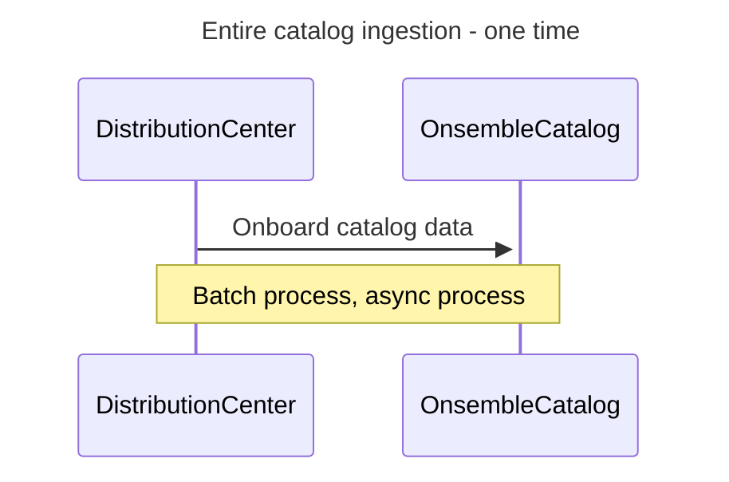
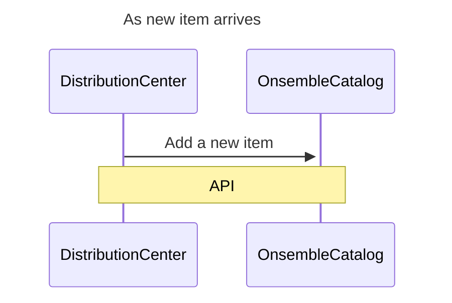
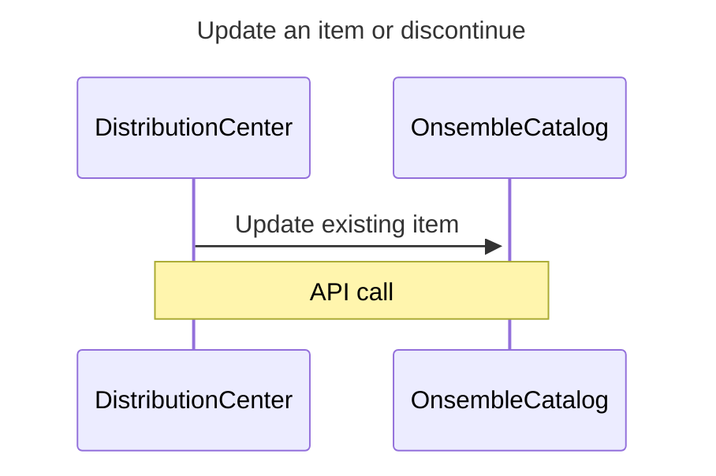
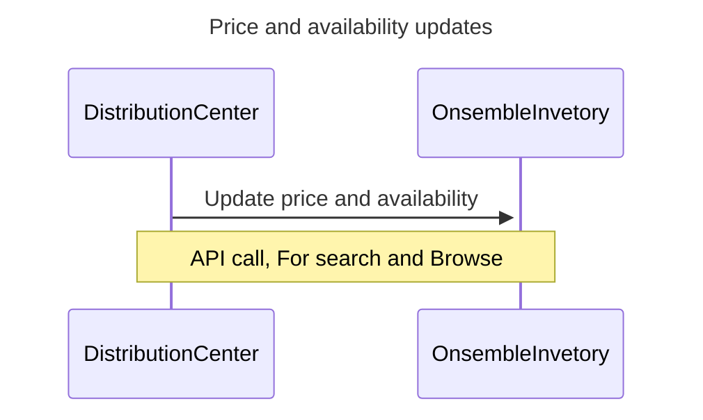
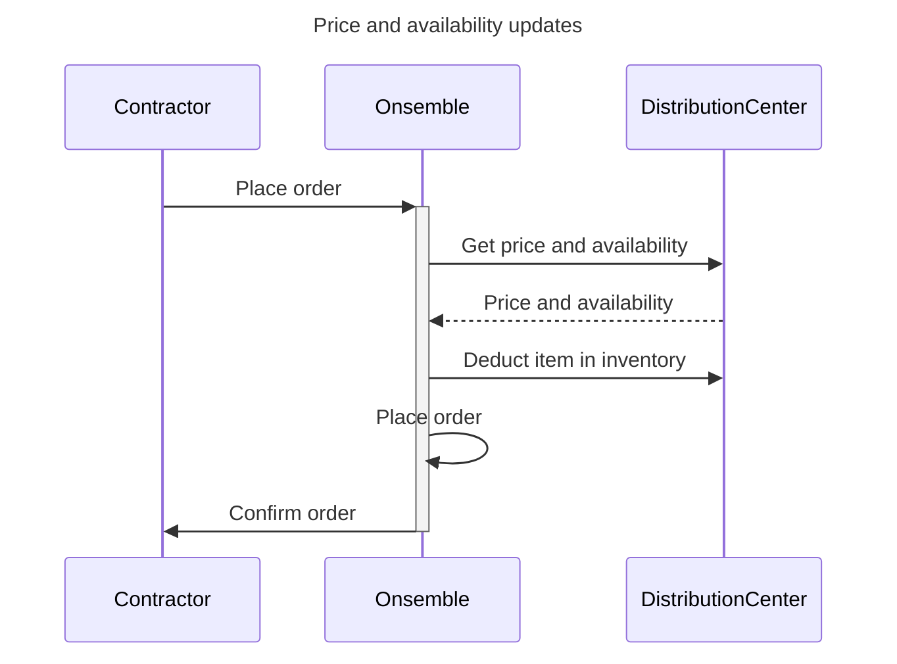
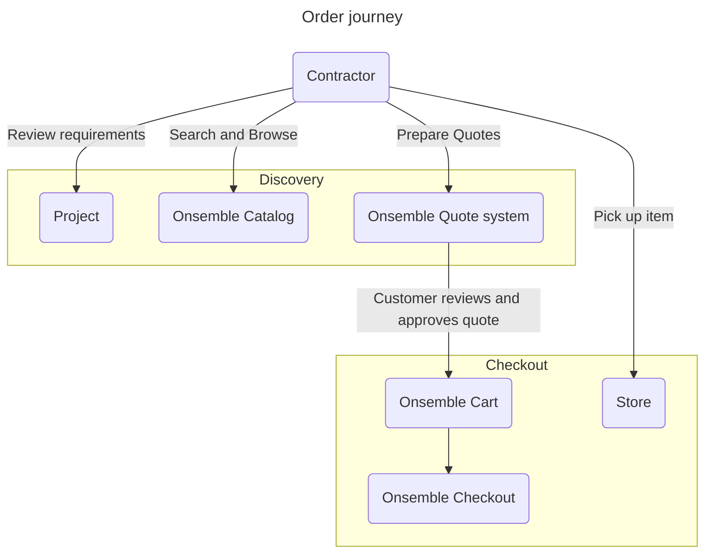

# Onsemble<>DistributionCenter
## Bulk catalog ingestion

## Add a new item

## Update existing item

## Track price and availability

## Lock in price and availability

# Onsemble<>customer
## Order journey

